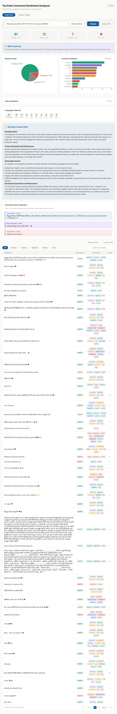

# 📺 YouTube Comment Sentiment & Emotion Analyzer 2.0

A high-performance, full-stack application that goes far beyond simple sentiment analysis. It performs deep psychological profiling, abuse detection, and time-series analysis of YouTube comments using an ensemble of custom AI models, providing actionable, data-driven insights for content creators.

 *( you run the dashboard locally to see the stunning dark-mode UI!)*

---

## ✨ Key Features (2.0 Update)

### 🧠 Deep Psychological Profiling
* **28-Category Emotion Model:** Upgraded from a basic 7-label model to a comprehensive, fine-tuned **GoEmotions-based model** (joy, anger, realization, disappointment, curiosity, etc.).
* **Multi-Label Thresholding:** Detects complex, nuanced emotional states. A single comment can now be correctly identified as both "gratitude" AND "joy".
* **Mixed Sentiment Detection:** Automatically flags comments expressing conflicting opinions (e.g., "Great video, but the audio is terrible").

### 🛡️ Automated Moderation & Toxicity Filtering
* **Multilingual Toxicity Detection:** Integrated `citizenlab/distilbert-base-multilingual-cased-toxicity` to detect abuse, hate speech, and spam.
* **Strict Slang Tolerance:** Precision-tuned thresholding (`>0.985`) ensures enthusiastic internet slang ("this is a banger!") isn't falsely flagged as toxic.
* **Protective UI:** Toxic comments are isolated into a priority queue and visually blurred by default to protect moderators.

### 📈 Advanced Analytics & Visualizations
* **Time-Series Analysis:** A dynamic Timeline graph tracks viewer sentiment over time, allowing creators to correlate audience mood swings with specific events or publishing times.
* **Interactive Dashboard:** A stunning, responsive React 19 dashboard featuring 28-color emotion mapping, sentiment pie charts, and real-time filtering.
* **Data-Driven AI Suggestions:** Automatically generates context-aware advice (e.g., "High negative sentiment detected regarding audio quality" or "Viewers are asking for a part 2").

---

## 🛠️ Tech Stack

**Backend (Inference & API):**
* **Framework:** FastAPI (Python 3.11+)
* **Machine Learning:** PyTorch, Hugging Face Transformers (`XLM-RoBERTa`, `DistilBERT`)
* **MLOps:** MLflow for experiment tracking and historical run logging.
* **Data Processing:** Pandas, langdetect

**Frontend (Dashboard):**
* **Framework:** React 19.2 (Vite)
* **Styling:** Vanilla CSS (Sleek Dark Mode, Glassmorphism, Micro-animations)
* **Data Visualization:** Recharts, Lucide Icons

---

## 📦 Setup & Installation

### 1. Environment Setup

```bash
# Clone the repository
git clone <your-repo-url>
cd sentiment-analyzer

# Create and activate environment
python -m venv venv
venv\Scripts\activate  # Windows
source venv/bin/activate  # Linux/macOS

# Install dependencies
pip install -r requirements.txt
```

### 2. Configure Credentials

Create a `.env` file in the root directory:

```env
YOUTUBE_API_KEY=your_youtube_api_key_here
```

*(You can get a free API key from the Google Cloud Console by enabling the YouTube Data API v3).*

### 3. Run the Application

**Terminal 1 (Backend API):**
```bash
uvicorn api:app --reload
```

**Terminal 2 (Frontend Dashboard):**
```bash
cd dashboard
npm install
npm run dev
```

Visit `http://localhost:5173` in your browser to access the dashboard!

---

## 🧠 Under the Hood: The AI Pipeline

The application passes scraped comments through a robust multi-stage NLP pipeline:
1. **Language Detection:** Identifies the language of the comment (handles mixed-language input).
2. **Base Sentiment:** A multilingual XLM-RoBERTa model calculates the foundational polarity (Positive, Neutral, Negative).
3. **Emotion Extraction:** Our custom fine-tuned `DistilRoBERTa` applies a sigmoid threshold (`>0.3`) across 28 distinct emotional axes.
4. **Toxicity Screening:** A specialized zero-shot classification model scans for abuse, shielding the UI with safety blurring.
5. **Contextual Aggregation:** The backend aggregates the dataset to discover topics, pin suggestions, and compute like-weighted sentiment graphs.

---

## 📂 Project Structure

```text
sentiment-analyzer/
├── api.py                 # FastAPI routing, caching, and payload generation
├── models.py              # ML pipeline initialization and inference logic
├── analysis.py            # Pandas aggregations, timeline tracking, mixed sentiment
├── fetcher.py             # YouTube API integration and comment scraping
├── suggestions.py         # Heuristic engine for generating creator advice
├── dashboard/             # React frontend (Vite)
│   ├── src/
│   │   ├── components/    # Reusable UI elements (SentimentCards, CommentTable, etc.)
│   │   ├── index.css      # Core design system and CSS tokens
│   │   └── App.jsx        # Main dashboard view
├── fine-tuned-emotion-model/ # Exported weights for the 28-class GoEmotions model
└── requirements.txt       # Python dependencies
```

---

## 📈 MLflow Experiment Tracking

Every analysis run is automatically logged locally via MLflow to `mlflow.db`. 

To view your historical performance data, run:
```bash
mlflow ui
```
Then open `http://localhost:5000` to visualize how your content reception has evolved across multiple videos.

---

## 🤝 Contributing

Contributions are always welcome! Whether it's adding a word-cloud visualization, refining the topic modeling heuristic, or expanding the AI suggestions logic, feel free to open a Pull Request.

---

*Originally created by Teshan G.H.P | University of Ruhuna*
